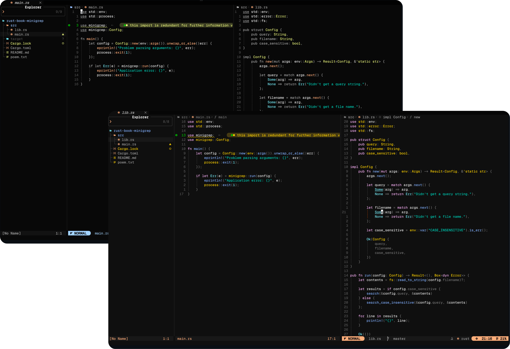

<h2 align="center">Open Code Colourscheme for Nvim</h2>

<p align="center">Unofficial port of the <a href="https://github.com/anomalyco/opencode">OpenCode</a> oc-2 theme for Neovim</p>

<p align="center">
  
</p>

## Variants

- **oc-2** — faithful port of the original oc-2 theme, keeping as close to the source as possible
- **oc-2-noir** — custom adaptation with slightly more contrast (this variant may change more as I'm still playing with the colours)

## Installation

Using [Lazy](https://github.com/folke/lazy.nvim):

```lua
{ '0xleodevv/oc-2.nvim' },
```

Using [Packer](https://github.com/wbthomason/packer.nvim):

```lua
use '0xleodevv/oc-2.nvim'
```

## Configuration

```lua
require('oc2').setup({
    theme = "oc-2", -- "oc-2" | "oc-2-noir"
    overrides = {}, -- A dictionary of highlight group overrides
})
```

Then set the colorscheme:

```lua
vim.cmd.colorscheme('oc-2')
-- or
vim.cmd.colorscheme('oc-2-noir')
```

## Status

Early stage — some colours may not be accurate yet. The noir variant in particular is still evolving. Very happy for contributions! If you spot an inaccurate colour or have improvements, please open an issue or PR.

## License

[MIT License](LICENSE)
